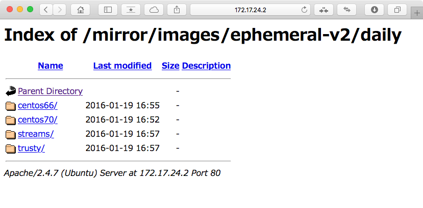

Title: Ubuntu MAAS 1.9 クイックセットアップガイド
Company: 日本仮想化技術

# Ubuntu MAAS 1.9<br>クイックセットアップガイド

<div class="title">
バージョン：0.9.2<br>
2017年06月26日<br>
<br>
日本仮想化技術株式会社
</div>

<!-- BREAK -->

## 変更履歴

|バージョン|更新日|更新内容|
|:---|:---|:---|
|0.9.0|2016/01/21|初版|
|0.9.1|2016/10/11|MAASノードにインストールするlibvirt-binについて追記|
|0.9.2|2017/06/26|レイアウト崩れの修正|

## 対象のバージョン

API                 | Version              
------------------- | ------------------- 
MAAS                | 1.9.0+bzr4533
ESXi                | 5.5 Update 3
libvirtd            | 1.2.2
KVMホストのKernel   | 3.13.0-76-generic

これ以降のバージョンでも同様に動作すると思います。

<!-- BREAK -->

## 目次
<!--TOC max3-->

<!-- BREAK -->


## 手順概要

このドキュメントはUbuntu MAAS環境を作成して、仮想サーバーや物理サーバーをMAASで管理する手順を示します。
本例ではMAAS 1.9.0+bzr4533を使っています。

これから、次の手順でそれぞれのセットアップを行います。

- 仮想マシンを作成
  - イメージサーバー用
  - MAASサーバー用
  - 仮想ノード
- 仮想マシンにUbuntu Serverのインストール
  - イメージサーバー用
  - MAASサーバー用
- イメージサーバーのミラーを構築
- MAASのインストールとセットアップ
- MAASにノードを登録
  - 仮想ノード or Other

※本例ではvCenter Serverのセットアップについては触れません。


## ESXiについて

MAAS 1.8以降はESXi 5.5、Linux KVMの管理ができる様になっており、ハイパーバイザー上の仮想マシンをMAASの仮想ノードの一つとして管理可能です。ESXiのマイナーバージョンはなんでも構わないため、本例ではESXi 5.5 Update 3を利用します。MAASがESXiと連携するにはvSphere APIが利用できる必要があります。そのため、有償(もしくは評価版)ライセンスが適用されたESXiである必要があります。

## ネットワークスイッチについて

何を使っても構いませんが、STPの設定...Ciscoスイッチで言うところのPortFastはenableにしてください。[詳細はこちら](https://maas.ubuntu.com/docs/install.html#configure-switches-on-the-network)。

<!-- BREAK -->

## イメージサーバーの作成

MAASでデプロイするOSのイメージは通常「maas.ubnntu.com」サーバーから取得しますが、ローカル環境にイメージサーバーのミラーを作成できます。詳細手順については公式の情報を確認してください。

- [イメージサーバーのミラーを作成する方法(英語)](https://maas.ubuntu.com/docs/sstreams-mirror.html)

ミラーするイメージが置かれているマスターイメージサーバーは次の通りです。MAASのデフォルト設定ではリリース版のイメージURLが設定されています。

- [リリース版](http://maas.ubuntu.com/images/ephemeral-v2/releases/)
- [デイリー版](http://maas.ubuntu.com/images/ephemeral-v2/daily/)

次のようにコマンドを実行すると、ミラー作成に必要なパッケージを全てインストールできます。

````
$ sudo apt-get install simplestreams ubuntu-cloudimage-keyring apache2
$ sudo mkdir -p /var/www/html/mirror/
````

マスターからミラーリングするには次のように実行します。

````
$ sudo sstream-mirror --keyring=/usr/share/keyrings/ubuntu-cloudimage-keyring.gpg http://maas.ubuntu.com/images/ephemeral-v2/releases/ /var/www/html/mirror/images/ephemeral-v2/releases 'arch=amd64' 'subarch~(generic|hwe-t)' 'release~(trusty|precise)' --max=1
````

`http://maas.ubuntu.com/images/ephemeral-v2/releases/` が対象とするイメージのバージョンで、リリース(/releases)かデイリー(/daily)のうち、どちらかを設定します。

`/var/www/html/mirror/ephemeral-v2/releases` はローカル側のファイルの置き場です。Apache2を使ってイメージファイルを配信するので、`/var/www/html/`の下にマスターと同じディレクトリー構成のファイル群を配置します。

`arch=amd64やsubarch~(generic|hwe-t)` は、イメージのアーキテクチャーを指定しています。

`release~(trusty|precise)` はインポートしたいイメージを指定します。指定できるイメージはリリース、デイリーのどちらかを指定したかによって異なります(執筆日時点)。

`--max=1`の指定は、インポートするイメージの世代数を設定します。1の場合は最新イメージのみ、2以降は最新のイメージからその数の世代までインポートします。

<!-- BREAK -->

コマンドを実行してミラーが完了したら、ブラウザでアクセスして参照可能なこと、ダウンロード可能なことを確認します。



MAASをインストール後にMAASの設定を開き、「Boot Images」のSync URLをミラーサーバーに書き換えます。


<!-- BREAK -->

## MAASのインストール

MAAS 1.9をインストールする前にUbuntu Server 14.04をインストールします。インストール後はアップデートを行い、最新の状態にします。インストールしたUbuntu ServerにMAAS 1.9をインストールするため、MAASのPPAを追加します。

まず、PPAの追加に必要なパッケージをインストールします。

````
$ sudo apt-get install software-properties-common python-software-properties
````

安定版のパッケージを使う場合は次の通りコマンドを実行します。

````
$ sudo add-apt-repository ppa:maas/stable
````

リポジトリーを追加したので、リポジトリー情報を更新します。

````
$ sudo apt-get update
````

MAASパッケージを確認します。

````
$ apt-cache policy maas 
````

MAASをインストールします。

````
$ sudo apt-get install maas
````

[Web UIにアクセス](https://maas.ubuntu.com/docs/install.html#post-install-tasks)して、管理ユーザーのセットアップを実行します。


### ESXi VMをMAASで利用する

MAASホストにMAAS 1.9でESXi VMをマネージメントするために必要なパッケージをインストールします。

````
maas$ sudo apt-get install python-pyvmomi
````

ESXiで必要なだけの仮想マシンを次の設定で作成します。

- VMのリソース(vCPU、メモリー、ストレージサイズ)を動かしたいOSに合わせて設定
- VMのvNICはMAASクラスターネットワークと接続されたネットワークと接続
- ESXi VMのBIOSを起動して、「1.PXEブート、2.HDDブート」の順に設定


### KVM VMをMAASで利用する

MAASホストにMAAS 1.9でESXi VMをマネージメントするために必要なパッケージをインストールします。

````
maas$ sudo apt-get -y install libvirt-bin
````

virshコマンドを使うために上記パッケージをインストールしたので、自動起動したサービスは停止するように設定します。

#### Upstart

````
maas$ echo "manual" > /etc/init/libvirt-bin.override
````

#### Systemd

````
maas$ sudo systemctl stop libvirt-bin.service
maas$ sudo systemctl disable libvirt-bin.service
````


KVMホストにはssh-askpass-gnomeを入れます。

````
kvm$ sudo apt-get install kvm virt-manager ssh-askpass-gnome
````

MAASユーザーとディレクトリーの作成、Bashへの切り替えを行います。

````
maas$ sudo mkdir -p /home/maas
maas$ sudo chown maas:maas /home/maas
maas$ sudo chsh -s /bin/bash maas
````

MAASユーザーのパスワードなしSSHキーペアを作成します。

````
maas$ sudo -u maas ssh-keygen
````

KVMホストにMAASサーバーで作成したSSHキーを転送します。

- 実行例 

````
maas$ sudo -u maas -i ssh-copy-id ytooyama@192.168.10.11
````

次のように実行してリモートKVMホスト上のVM一覧が見えることを確認

````
maas$ sudo -u maas virsh -c qemu+ssh://ytooyama@192.168.10.11/system list --all
````

ブリッジ用NICを作成します。作り方は[公式Wikiの手順](https://help.ubuntu.com/community/KVM/Networking)に従ってください。

コマンドもしくは仮想マシンマネージャーで必要なだけの仮想マシンを次の設定で作成します。

- VMのリソース(vCPU、メモリー、ストレージサイズ)を動かしたいOSに合わせて設定
- VMのvNICはMAASクラスターネットワークと接続されたネットワークと接続
- 起動オプションとして「1.Network(PXE)、2.HardDisk」の順に設定

<!-- BREAK -->

## MAASのセットアップ

MAASをデプロイツールとして利用するため、残りの作業を実施します。必要なセットアップ項目は次の通りです。

- MAASダッシュボード(http://maas-server-ip/MAAS)にアクセス
- [Cluster Interfaceの設定](https://maas.ubuntu.com/docs/install.html#configure-dhcp)
  - アドレス配布に使うNICを指定
  - 管理するサービスを指定(ex. "DHCP and DNS")
  - ゲートウェイのIPアドレス
  - DHCP dynamic IP range(Enlist、Commissioningなどで利用)
  - Static IP range(ノードに割り当てる範囲)
- ユーザー設定
  - ユーザーに割り当てたノードにデプロイしたOSに設定するSSH公開鍵を登録
- 全般設定
  - Upstream DNSの設定(スペース追加で複数DNSを指定可能)
  - DNSSECの設定(Upstream DNSの対応状況に応じて変更)
  - イメージのURLをミラーサーバーに設定変更
- [イメージのインポート](https://maas.ubuntu.com/docs/install.html#import-the-boot-images)
  - UbuntuイメージはCommitioningに必要なのでインポート必須
  - その他OSをダッシュボードやコマンドなどで追加してインポートを実行する 
- ノードを追加
  - 物理ノード、仮想ノードなどをMAASに登録

<!-- BREAK -->

## MAASに仮想ノードを登録する

MAASにノードを追加するには次のように行います。

- マシンを起動するとEnlistが行われる
- MAASダッシュボードにアクセスして、マシンの情報を入力

[ESXi 仮想ノードを追加する例]

項目          | 設定例
------------- | -------------
Power type    | VMware
Name          | VM名
UUID          | VMのUUID
hostname      | ESXiのIPアドレスもしくはFQDNで
user          | ユーザー
password      | パスワード
API Port      | 443
API protocol  | https


[KVM 仮想ノードを追加する例]

項目          | 設定例
------------- | -------------
Power type    | Virsh
Power address | qemu+ssh://ytooyama@192.168.10.11/system
Power ID      | VM名
Power Password| (空)

<!-- BREAK -->

[物理ノードを追加する例]

項目          | 設定例
------------- | -------------
Power type    | IPMI
Power driver  | LAN_2.0[IPMI 2.0]
IP address    | Web管理ツール※ のIPアドレス
Power user    | Web管理ツール※ のログインユーザー
Power password| Web管理ツール※ のログインパスワード
Mac address   | MAASクラスターネットワークに接続しているNICのMACアドレス

※Web管理ツール...HPの場合はiLo、Dellの場合はiDrac。

- 設定が正しければ、次回パワーオンするとOSのプロビジョニングが始まります
- 起動後はログなどを確認します

````
$ sudo tail -f /var/log/maas/maas.log
````

<!-- BREAK -->

## 参考情報

### ESXi VMにNested Virtualizationを設定する

`/vmfs/volumes/[your-datastore]/[your-vm]/[your-vm].vmx`に「vhv.enable = "TRUE"」を追記してVMを起動します。
OS起動後、Linuxなら`lsmod |grep kvm`や`kvm-ok`などで確認します。

### ESXi VMのUUIDを確認する

UUIDはESXiコンソール上で次のようにコマンドを実行すると確認できます。
VMのUUIDはvmxファイルに書かれているので、grepすると目的の項目を見つけられます。

````
esxi-host # cat /vmfs/volumes/datastore/esx-vm1/esx-vm1.vmx |egrep "displayName|uuid.bios"
uuid.bios = "56 4d 8f cd e3 38 19 71-c3 93 81 29 64 eb 9a cc"
````

### MAASにESXi VMのUUIDを設定する

ESXi VMのUUIDがわかったら、UUIDを「8-4-4-4-12」表記に直してMAASに設定します。

(例) 564d8fcd-e338-1971-c393-812964eb9acc